# Case Organizer v4

Case Organizer is a full-stack legal case-management and document-organization platform built with Flask.  
It helps law practices structure, archive, and retrieve their case files, generate invoices, and manage internal communication — all within a private, self-hosted environment.

---
## AI Use Notice

   ```
   Version 4.2 onwards I have begun emplyoing the use of Claude Code to assist in bug fixes, patches and UI changes.
   It has proven to be a rather useful tool, but rest assured, control and quality checks remain with me as the primary maintainer and developer.
   This notice serves to add to, and maintain a standard of transparency for those who may stumble upon this project.
   ```
---
## Overview

Version 3 introduced secure email-based authentication, internal messaging, integrated invoicing, and Debian-package deployment for seamless installation on Linux servers.

Version 4 continues that foundation with a fully rebuilt Case Law module, a structured citation system, PDF editing integration, and a consistent custom UI component layer.

---

## Screenshots

_Current UI (v4.6, default dark theme)._

### New in v4.6 — Calendar & court-event tracker

**A full calendar and per-case event tracker** — hearing / listing dates, filing deadlines (with mark-as-filed), appearance records, and limitation deadlines, all colour-coded on a month grid that scales to fill the window. A resizable, repositionable sidebar (side and width persisted per browser) shows either the day agenda or a per-case timeline:

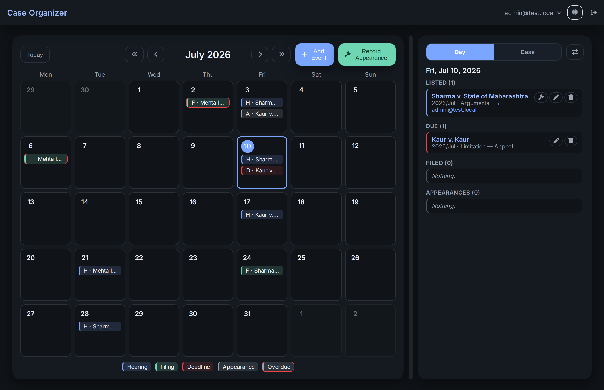

| Per-case timeline (past → future) | Add event — search a case, dd/mm/yyyy dates, digest assignees |
| --- | --- |
| 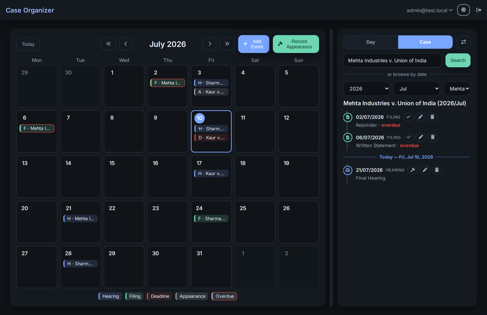 | 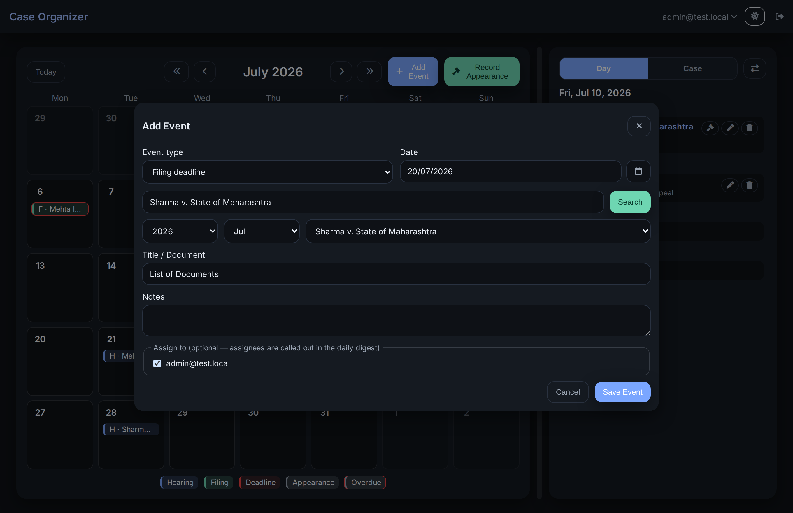 |

**Record Appearance** captures who appeared (team members or outside counsel by name) and the outcome; entering the next date auto-creates the linked next hearing. **Admin → Records** deletes stored Legal Notice and Certificate entries, with a hover note and a delete confirmation:

| Record appearance → auto next hearing | Records — delete notice / certificate entries |
| --- | --- |
| 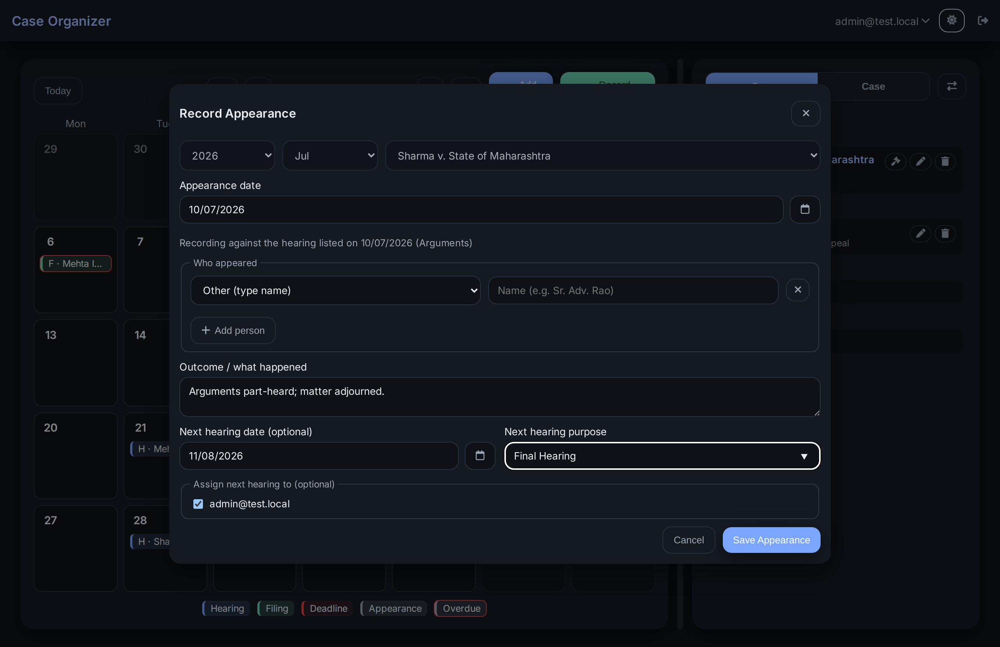 | 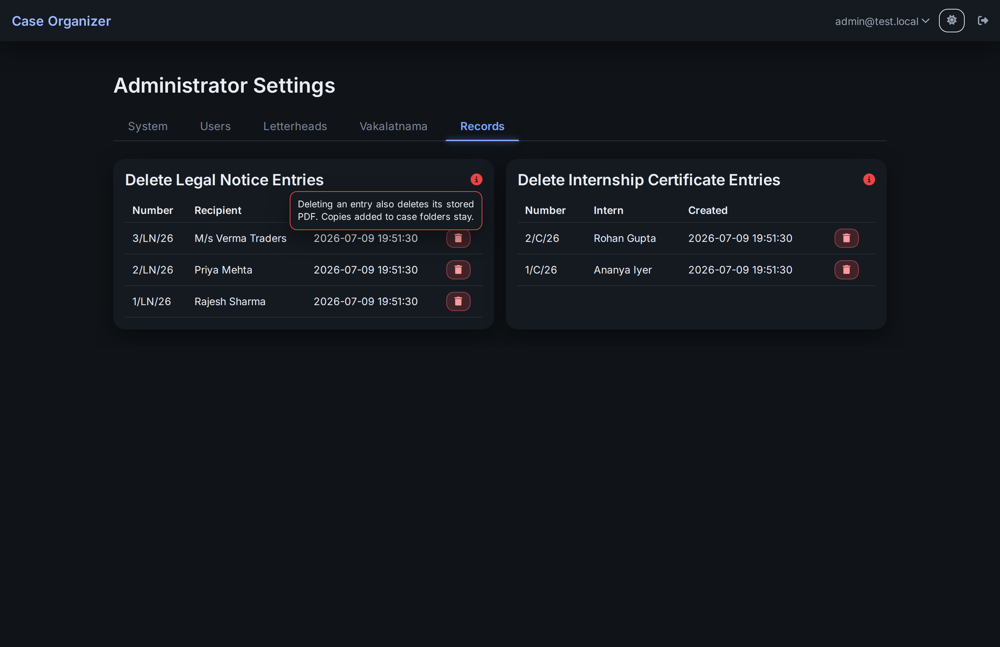 |

A **daily digest email** (configurable send time, opt-in per install) lists each morning's hearings, filings due, overdue items, and tomorrow's matters; events assigned to a user are called out in their copy. Interns get **view-only** access to the calendar.

### New in v4.5.2

**Create Case — one Case Category, one Original court block, and a unified, searchable Supreme Court + High Court picker** (type a lower/trial court and it's offered back as a custom option):

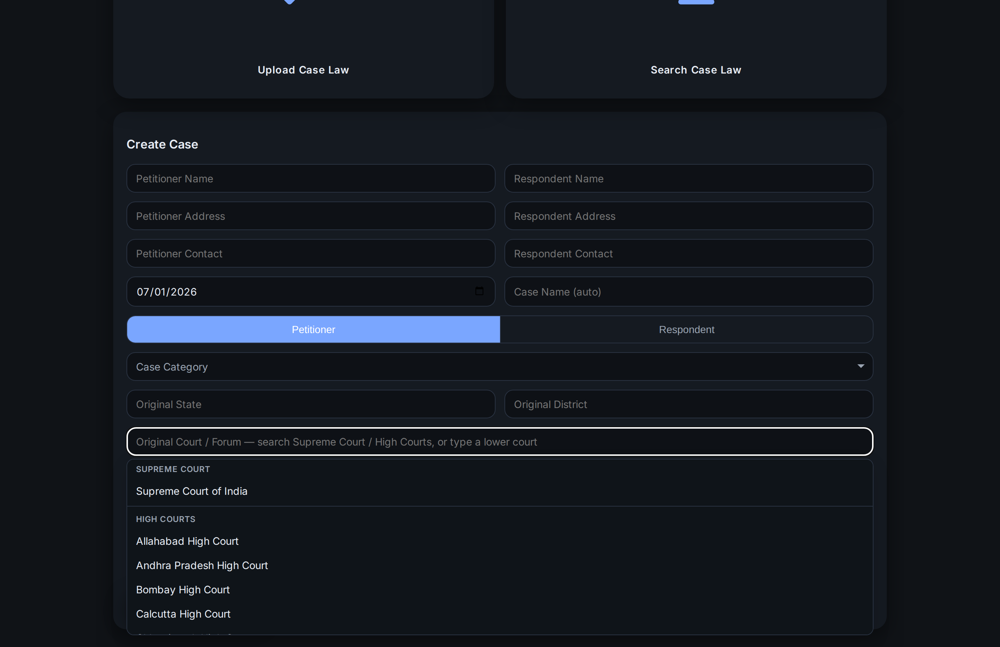

| Free-text court entry ("use as typed") | "Current Forum/Place" → In Appeal |
| --- | --- |
| 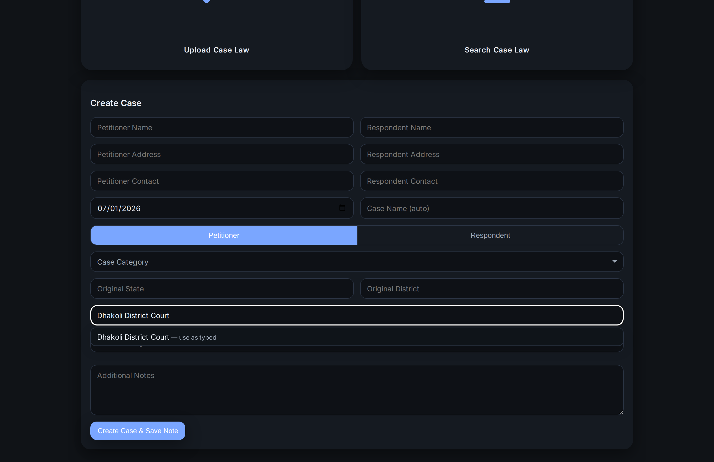 | 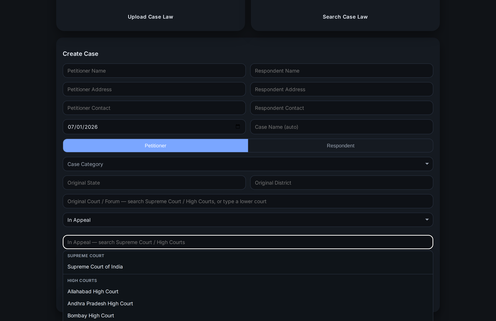 |

**Manage Cases — grouped, searchable File Subcategory taxonomy** (47 divisions / 322 filing types under Civil, Criminal and Commercial, each with an "Other"):

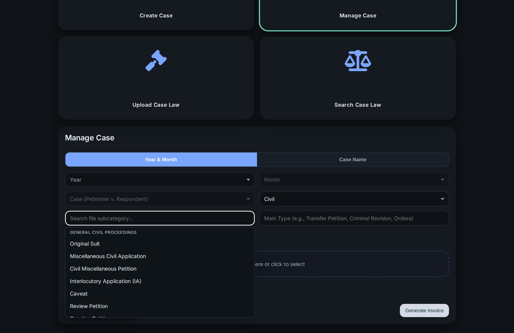

**Search Case Law — Name tab with each party option on its own full-width row:**

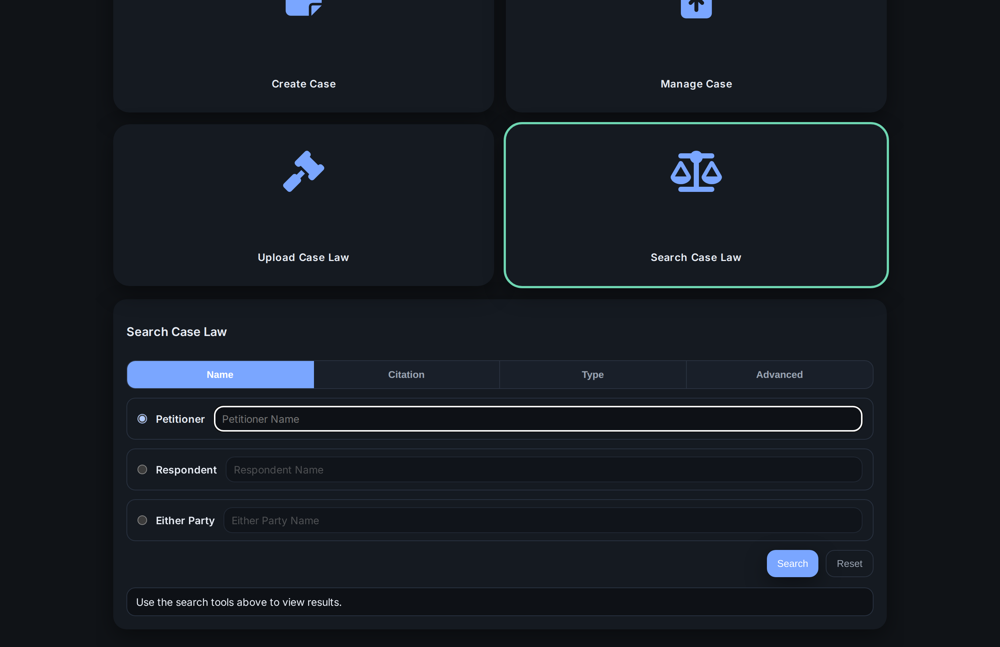

### Modules

| Dashboard | Certificate generator | Legal Notice |
| --- | --- | --- |
| 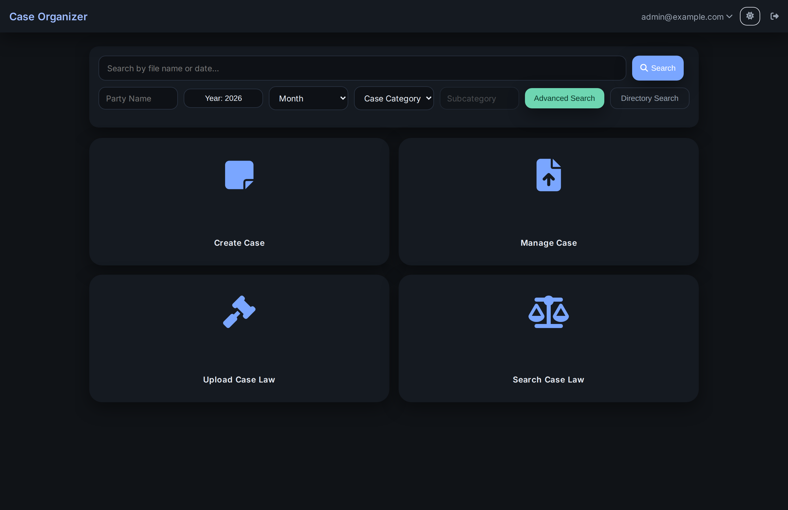 | 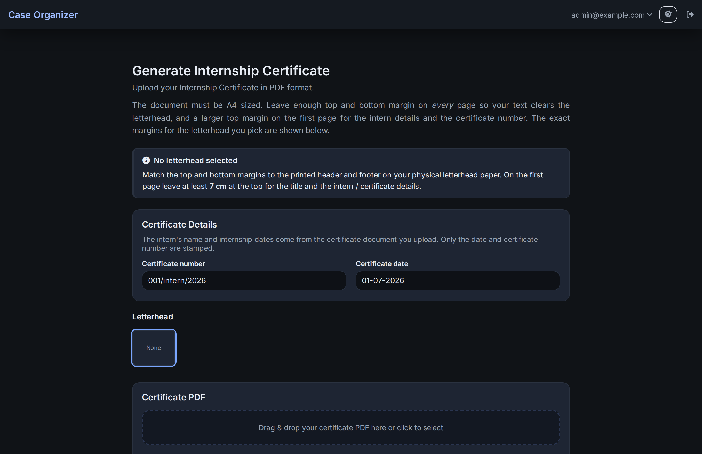 | 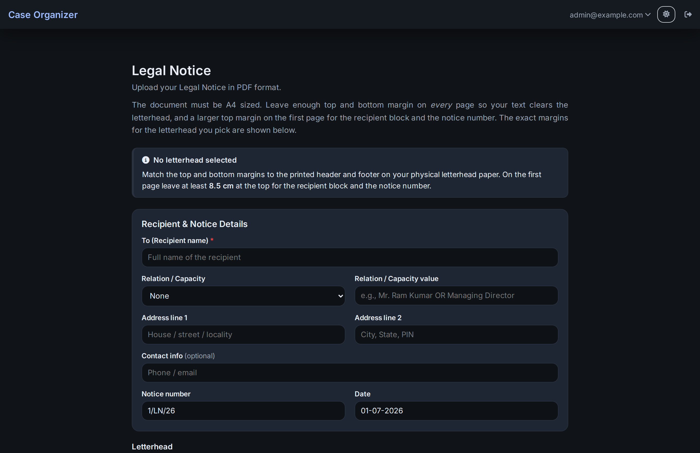 |

---

## Features

### Core System
- Built on **Flask 3.0** and **Werkzeug 3.0** with hardened routing and isolated session management.
- Fully Debian-packaged (`.deb`) for one-command deployment and auto-systemd integration.
- Secure password storage with **argon2-cffi** and **cryptography** modules.
- Configurable filesystem root (`fs-files`) for all case data.

### Authentication and Accounts
- Email-based login replacing the shared-password model.  
- Password reset via secure SMTP-delivered reset codes.  
- Users can update their username, email, and password independently.  
- Automatic logout after 10 minutes of inactivity for security.

### Administration
- Admins can:
  - Create users with temporary credentials.  
  - Assign roles between *admin*, *standard user*, and *intern* — interns are restricted to the home page, their account, the PDF tools, internal mail, and view-only calendar access.  
  - Edit or delete user accounts.  
  - Update or relocate the root storage path live.  
  - Delete server files directly from the dashboard.  
  - Delete generated **Legal Notice** and **Certificate** registry entries (and their stored PDFs) from the *Records* tab.  
  - Configure the **daily digest** email (send time, on/off, test send).


### UI and UX
- Flattened, consistent styling across all pages.


- Password-visibility toggle on login form.


  
- Dark/light theme compatibility.
  


- Clear disabled states and keyboard-focus polish.
- Custom **Long-List Dropdown** component replaces all native `<select>` elements for consistent, scroll-limited dropdowns in both light and dark themes.
- Tab-style toggle buttons for binary choices (e.g. "We're Representing").
- Dropdown panels automatically flip upward when near the bottom of the viewport.
- **Markdown rendering** in Case Notes ("Additional Notes") and Case Law briefs, with live preview in search results.
- AFK-aware session keepalive — active typing and in-browser processing no longer trigger premature auto-logout.

### Case Management
- Create, edit, and organize structured case directories:

   ```none
  fs-files/
    YYYY/
      MMM/
        Petitioner v. Respondent/
          Note.json
          Petitions_Applications/
          Orders_Judgments/
          Primary_Documents/
    Case_Law/
      Category/
        Case Type/
          YYYY/
            Petitioner v. Respondent/
    Invoices/
  ```
- **Dual-tab Manage Case** interface:
  - Name lookup pre-fills year/month automatically.
  - Notes stay synchronized with the active case.
- Integrated **Case Law** module:
  - Upload, tag, and search case-law documents.
  - Tabbed search with admin-only delete access.
  - **Court/Forum selection** — Supreme Court, Federal Court, Privy Council, and all current and historical Indian High Courts with a searchable dropdown.
  - **Structured citation system** — per-row entries for INSC, SCC, SCC Online, SCR, and AIR formats, each auto-formatting based on journal rules (volume, court abbreviation, page number). Multiple citations per case supported.
  - **Edit Case Law** — full metadata editing (court, citations, classification, notes) via the View/Edit Note modal, with database and note.json kept in sync.
  - Legacy free-text citations auto-migrate to structured rows where parseable; unrecognised entries are flagged with a banner for manual correction.
  - **Citation search tab** — search by journal, year, volume, and page number against the normalised citations table.
  - Bidirectional year sync between the Decision Year field and all citation row year inputs; new citation rows auto-populate year from existing context.
  - Integer-only enforcement on citation Year, Volume, and Page/Entry fields.
- Auto-naming of files:
  ```none
  (DDMMYYYY) TYPE DOMAIN Petitioner v. Respondent.ext
  ```
  Reference files keep original names with case suffix.

### Calendar & Court-Event Tracker
- **Per-case events** on a full-viewport month grid with colour-coded chips: hearings/listings (with purpose), filing deadlines, appearance records, and other deadlines (e.g. limitation periods). Overdue, unfiled items are flagged.
- **Day agenda** — for any date, what is *listed*, *due*, *filed*, and *who appeared*; **per-case timeline** shows the full history (past → future) with a "today" divider, reachable by the same case-name search as Manage Case or by year/month browsing.
- **Record Appearance** — a single flow to note who appeared (team members or outside counsel by name) and the outcome; entering the next date auto-creates and links the next hearing.
- **Filing lifecycle** — a filing carries a due date and is later marked filed on its actual date; "mark filed" moves it into the day's *Filed* bucket.
- **Resizable sidebar** — the Day/Case panel can be widened by dragging and moved to either side; the choice is saved per browser.
- **Daily digest email** — an in-process scheduler sends every morning (send time and on/off configurable under *Settings → System → Daily Digest*, with a "Send test digest now" button) to active admins and users, listing today's hearings, filings due, overdue items, and tomorrow's matters. Events can be **assigned** to users, who are called out in their own copy. Idempotent per day, so restarts never double-send.
- All dialog dates use the Indian **dd/mm/yyyy** format with a calendar-picker button; events follow a renamed case and are removed with a deleted one.

### Invoicing
- Full PDF invoice generator using **ReportLab**.  
- Accessible both globally and per-case.  
- Dual save: global `Invoices/` archive and per-case folder.  
- Context-aware UI disables irrelevant controls until a case is selected.


### Internal Messaging
- Built-in mailbox for users to send, receive, and read messages.  
- Asynchronous SMTP notifications prevent UI blocking.  
- Optional performance logging for slower servers.


### Search and Retrieval
- Multi-filter search:
  - Year / Month
  - Petitioner / Respondent
  - Domain + Subcategory
  - Citation (journal / year / volume / page)
  - Free-text queries
- Fast indexed search across Notes, Case Law, and Invoices.


### PDF Editing Suite
- PDF editing hub with PDF24-style workflow: drag/drop uploads, per-tool options,
  progress tracking, and one-click downloads.
- Tools included: Merge, Split (ranges/odd-even/visual), Compress (Rectal/Photon),
  Remove Pages, Rearrange Pages with thumbnails, Flatten PDFs, OCR with language
  picker + DPI presets, Add Page Numbers, and Image-to-PDF with ordering/preview.
- Jobs auto-delete 5 minutes after completion; Start toggles to Cancel to clear
  selections and reset the tool state.
- Integrated as the **BentoPDF** suite with a unified tool-search hub, wrapped in the Case Organizer top bar and theming.

> **Attribution:** The PDF editing suite is built on top of [BentoPDF](https://github.com/alam00000/bentopdf) by alam00000, used and adapted under its original licence. All credit for the underlying PDF tool framework goes to the BentoPDF project.


---

## Requirements

```text
Flask>=3.0
Werkzeug>=3.0
pdfminer.six>=20221105
python-docx>=1.1.0
argon2-cffi>=23.1.0
cryptography>=41.0.0
reportlab>=3.6.12
pypdf>=4.0.0
Pillow>=10.0.0
```

Python 3.10 or newer is required.

System packages for PDF tooling (recommended):
- `tesseract-ocr` (+ language packs such as `tesseract-ocr-all`)
- `poppler-utils` (for `pdftoppm` thumbnails/OCR rendering)
- `qpdf` (flattening + Rectal compression)
- `ghostscript` (Photon compression)

---

## Installation

### Option 1 – From Source

```bash
git clone https://github.com/<your-org>/case-organizer-v3.git
cd case-organizer-v3
python3 -m venv .venv
source .venv/bin/activate
pip install -r requirements.txt
python3 app.py
```

Access the app at:

```none
http://localhost:5000
```

---

### Option 2 – Debian Package

```bash
# Download the latest release
wget https://github.com/LORDINFINITY12/case-organizer-v3/releases/download/v4.2/case-organizer_4.2_all.deb

# Install the package
sudo dpkg -i case-organizer_4.2_all.deb

# Enable and start the service
sudo systemctl enable --now case-organizer.service
```

Once active, Case Organizer runs automatically on boot.  
Logs are available via:

```bash
journalctl -u case-organizer.service
```

---

### Option 3 – Docker (Windows / macOS / Linux)

> **Windows users:** the native one-click installer (Option 4 below) is now the
> recommended way to run Case Organizer on Windows — no Docker required.

#### Install Docker first

**Windows** (PowerShell, via [winget](https://learn.microsoft.com/windows/package-manager/winget/)):

```powershell
winget install -e --id Docker.DockerDesktop
```

**macOS** — install [Homebrew](https://brew.sh) if you don't have it, then Docker Desktop:

```bash
# Install Homebrew (skip if already installed)
/bin/bash -c "$(curl -fsSL https://raw.githubusercontent.com/Homebrew/install/HEAD/install.sh)"

# Install Docker Desktop
brew install --cask docker
```

**Linux** (Debian/Ubuntu):

```bash
curl -fsSL https://get.docker.com | sh
```

Launch **Docker Desktop** once after installing (Windows/macOS) so the engine is
running, then continue below.

#### Run Case Organizer

**A. One-click (Windows):** download `case-organizer_<version>_docker.tar.gz` and
`docker-setup.bat` from the [latest release](https://github.com/LORDINFINITY12/Case-Organizer_V4/releases),
put them in the same folder, and double-click `docker-setup.bat`. It loads the
image, starts the container with persistent storage under
`%USERPROFILE%\CaseOrganizer`, and opens the app in your browser. On
Linux/macOS run `./docker-setup.sh` instead.

**B. Load the release image manually:**

```bash
docker load -i case-organizer_4.5.2_docker.tar.gz
docker run -d --name case-organizer -p 5000:5000 \
  -e CASEORG_COOKIE_SECURE=0 \
  -v caseorg-config:/data/config -v caseorg-files:/data/files \
  --restart unless-stopped case-organizer:4.5.2
```

**C. Build from source with Compose:**

```bash
docker compose up -d          # builds and runs; data persists under ./data
```

Then open `http://localhost:5000`. On first-run **/setup**, set the storage
location to `/data/files` so case files land on the mounted volume (config lives
in `/data/config`). `CASEORG_COOKIE_SECURE=0` is required for plain-HTTP
localhost; put a TLS-terminating reverse proxy in front and set it to `1` for
HTTPS deployments.

### Option 4 – Windows (one-click installer) — recommended for Windows

Download `CaseOrganizer-Setup-<version>.exe` from the
[latest release](https://github.com/LORDINFINITY12/Case-Organizer_V4/releases)
and run it. No Docker, no Python, no admin rights needed — the installer
bundles everything, including the OCR/PDF tools (Tesseract, Poppler, qpdf,
Ghostscript).

1. Run the installer. Windows SmartScreen may warn about an unknown
   publisher — click **More info → Run anyway** (the exe is unsigned).
2. Pick an install mode when asked *"for all users / only for me"*:
   * **Only for me** *(default — right for a personal laptop)*: installs a
     **tray app**. Case Organizer runs while the tray icon is visible;
     optionally tick *Start with Windows*. Right-click the icon for
     **Open / Open data folder / Quit**.
   * **All users + "Install as a Windows service"** *(office/always-on PC)*:
     Case Organizer runs as a background **service** from boot, before
     anyone logs in, and restarts automatically if it crashes. Shortcuts
     simply open the app in your browser.
3. Your browser opens at the first-run setup page. Accept the suggested
   storage folder (or pick another) and create the administrator account.

Everything runs locally at `http://127.0.0.1:5000` (ports 5000–5010 are
tried automatically). Your data lives in `%APPDATA%\CaseOrganizer`
(`%ProgramData%\CaseOrganizer` for service installs) plus the storage folder
you chose — **uninstalling never deletes them**. Server logs:
`<data folder>\logs\server.log`.

Building the installer yourself: see
[windows/README-BUILD.md](windows/README-BUILD.md).

---

## First-Run Setup

1. **Storage and Users**  
   On first launch you’ll be redirected to `/setup`.  
   Select your storage root (`fs-files`) and define allowed users.

2. **Email Configuration**  
   Provide SMTP details for outgoing mail (password resets and notifications).

3. **Login**  
   Sign in using your registered email and password.

---

## Development Notes

- Configuration stored dynamically in `caseorg_config.py`.  
- Allowed file types: `.pdf`, `.docx`, `.txt`, `.png`, `.jpg`, `.jpeg`, `.json`.  
- Diagnostic routes:  
  - `/ping` – basic health check  
  - `/__routes` – list all Flask routes

---

---

## Attributions

| Component | Author | Repository |
|-----------|--------|------------|
| BentoPDF — PDF editing suite | alam00000 | https://github.com/alam00000/bentopdf |

The PDF editing tools integrated into Case Organizer (Merge, Split, Compress, OCR, Rearrange, and others) are sourced from the BentoPDF project. BentoPDF is embedded and served within the Case Organizer interface; all credit for the PDF tooling framework belongs to its original author.

---

**License:** GNU AGPL v3.0 with Additional Terms (see LICENSE for details)
